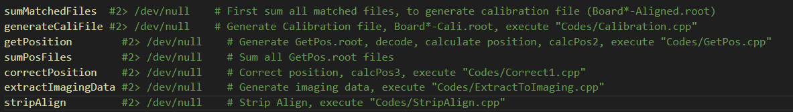

# AnalyzeData-IMP
Analyze data acquired from IMP muon tracker
注意：在WSL子系统下运行，需要安装ROOT6，linux虚拟机环境

## 文件夹结构：
- Cali：标定文件夹
- Codes：代码
- Source：原始数据，注意，是MuonDataProcessor工程中ScanFolders处理后的数据
- Sum：所有数据都会集合到此文件夹

## 使用：
- ProcessFolders.sh: 按照顺序运行，第一步加和能谱，第二步生成标定文件，第三步初步计算位置，第四步加和位置文件，第五步修正位置
